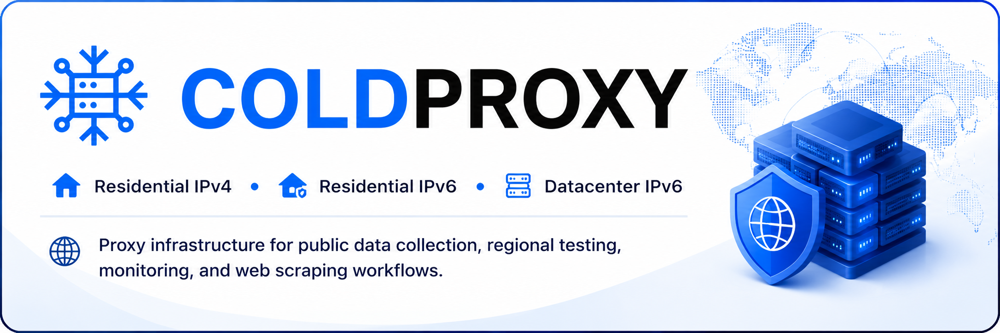
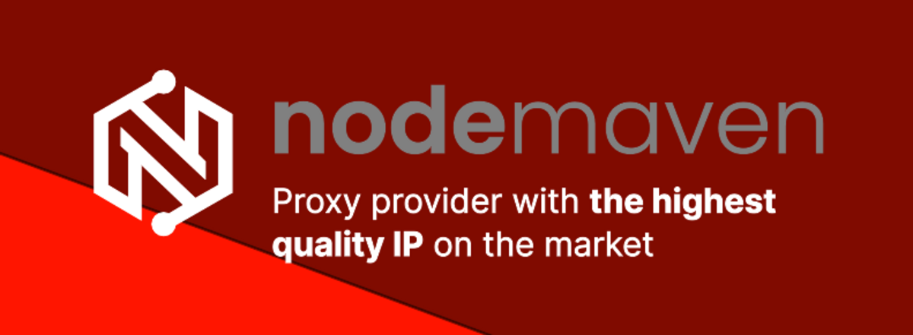
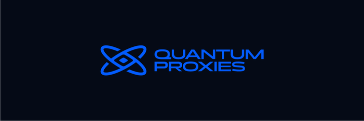
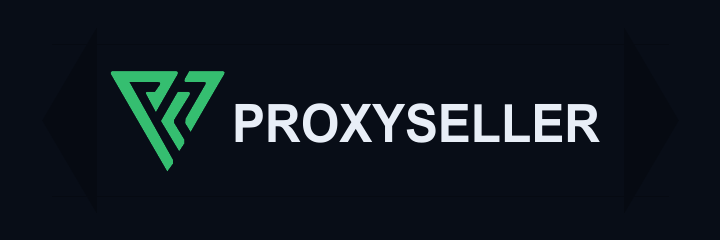
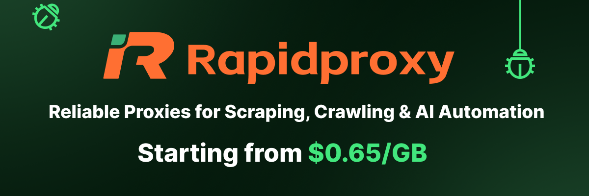

<p align="center">
  <a href="https://webclaw.io">
    
  </a>
</p>

<h1 align="center">webclaw</h1>

<p align="center">
  <strong>Turn websites into clean markdown, JSON, and LLM-ready context.</strong><br/>
  <sub>CLI, MCP server, REST API, and SDKs for AI agents and RAG pipelines.</sub>
</p>

<p align="center">
  <a href="https://github.com/0xMassi/webclaw/stargazers"></a>
  <a href="https://github.com/0xMassi/webclaw/releases"></a>
  <a href="https://github.com/0xMassi/webclaw/blob/main/LICENSE"></a>
  <a href="https://www.npmjs.com/package/create-webclaw"></a>
</p>

<p align="center">
  <a href="https://discord.gg/KDfd48EpnW"></a>
  <a href="https://x.com/webclaw_io"></a>
  <a href="https://webclaw.io"></a>
  <a href="https://webclaw.io/docs"></a>
</p>

<p align="center">
  
</p>

---

Most web scraping tools give your agent one of two bad outputs:

- a blocked page, login wall, or empty app shell
- raw HTML full of nav, scripts, styling, ads, and duplicated boilerplate

[webclaw.io](https://webclaw.io) is the hosted web extraction API for webclaw. This repo contains the open-source CLI, MCP server, extraction engine, and self-hostable server.

webclaw turns a URL into clean content your tools can actually use.

```bash
webclaw https://example.com --format markdown
```

```md
# Example Domain

This domain is for use in illustrative examples in documents.

You may use this domain in literature without prior coordination or asking for permission.
```

Use it from the terminal, wire it into Claude/Cursor through MCP, call the hosted API from your app, or self-host the OSS server.

---

## Install

### Agent setup

The fastest way to connect webclaw to Claude Code, Claude Desktop, Cursor, Windsurf, OpenCode, Codex CLI, and other MCP-compatible tools:

```bash
npx create-webclaw
```

The installer detects supported clients and configures the MCP server for you.

### Homebrew

```bash
brew tap 0xMassi/webclaw
brew install webclaw
```

### Prebuilt binaries

Download macOS and Linux binaries from [GitHub Releases](https://github.com/0xMassi/webclaw/releases).

### Docker

```bash
docker run --rm ghcr.io/0xmassi/webclaw https://example.com
```

### Cargo

```bash
cargo install --git https://github.com/0xMassi/webclaw.git webclaw-cli
cargo install --git https://github.com/0xMassi/webclaw.git webclaw-mcp
```

If building from source fails because native build tools are missing, install the platform prerequisites:

| OS | Command |
| --- | --- |
| Debian / Ubuntu | `sudo apt install -y pkg-config libssl-dev cmake clang git build-essential` |
| Fedora / RHEL | `sudo dnf install -y pkg-config openssl-devel cmake clang git make gcc` |
| Arch | `sudo pacman -S pkg-config openssl cmake clang git base-devel` |
| macOS | `xcode-select --install` |

---

## Quick Start

### Scrape one page

```bash
webclaw https://stripe.com --format markdown
```

### Return LLM-optimized text

```bash
webclaw https://docs.anthropic.com --format llm
```

### Keep only the main content

```bash
webclaw https://example.com/blog/post --only-main-content
```

### Include or exclude selectors

```bash
webclaw https://example.com \
  --include "article, main, .content" \
  --exclude "nav, footer, .sidebar, .ad"
```

### Crawl a documentation site

```bash
webclaw https://docs.rust-lang.org --crawl --depth 2 --max-pages 50
```

### Workflow examples

- [HTML to Markdown for RAG](examples/html-to-markdown-rag/)
- [Firecrawl-compatible API](examples/firecrawl-compatible-api/)
- [MCP web scraping](examples/mcp-web-scraping/)
- [Proxy-backed crawling with ColdProxy](examples/proxy-backed-crawling/)
- [Cloudflare diagnostics](examples/cloudflare-diagnostics/)

### Extract brand assets

```bash
webclaw https://github.com --brand
```

### Compare a page over time

```bash
webclaw https://example.com/pricing --format json > pricing-old.json
webclaw https://example.com/pricing --diff-with pricing-old.json
```

---

## MCP Server

webclaw ships with an MCP server for AI agents.

```bash
npx create-webclaw
```

Manual config:

```json
{
  "mcpServers": {
    "webclaw": {
      "command": "~/.webclaw/webclaw-mcp"
    }
  }
}
```

Then ask your agent things like:

```text
Scrape these competitor pricing pages and summarize the differences.
```

```text
Crawl this documentation site and prepare clean context for a RAG index.
```

```text
Extract the brand colors, fonts, and logos from this company website.
```

---

## Tools

| Tool | What it does | Local |
| --- | --- | :-: |
| `scrape` | Extract one URL as markdown, text, JSON, LLM format, or HTML | Yes |
| `crawl` | Follow same-origin links and extract discovered pages | Yes |
| `map` | Discover URLs without extracting every page | Yes |
| `batch` | Scrape multiple URLs in parallel | Yes |
| `extract` | Convert page content into structured data | Yes, with local or configured LLM |
| `summarize` | Summarize a page | Yes, with local or configured LLM |
| `diff` | Compare page content snapshots | Yes |
| `brand` | Extract colors, fonts, logos, and metadata | Yes |
| `search` | Search the web and scrape results | Hosted API |
| `research` | Multi-source research workflow | Hosted API |

---

## SDKs

```bash
npm install @webclaw/sdk
pip install webclaw
go get github.com/0xMassi/webclaw-go
```

<details>
<summary>TypeScript</summary>

```ts
import { Webclaw } from "@webclaw/sdk";

const client = new Webclaw({ apiKey: process.env.WEBCLAW_API_KEY! });

const page = await client.scrape({
  url: "https://example.com",
  formats: ["markdown"],
  only_main_content: true,
});

console.log(page.markdown);
```

</details>

<details>
<summary>Python</summary>

```python
from webclaw import Webclaw

client = Webclaw(api_key="wc_your_key")

page = client.scrape(
    "https://example.com",
    formats=["markdown"],
    only_main_content=True,
)

print(page.markdown)
```

</details>

<details>
<summary>cURL</summary>

```bash
curl -X POST https://api.webclaw.io/v1/scrape \
  -H "Authorization: Bearer $WEBCLAW_API_KEY" \
  -H "Content-Type: application/json" \
  -d '{
    "url": "https://example.com",
    "formats": ["markdown"],
    "only_main_content": true
  }'
```

</details>

---

## Output Formats

| Format | Use it when you need |
| --- | --- |
| `markdown` | Clean page content with structure preserved |
| `llm` | Compact context for agents and RAG pipelines |
| `text` | Plain text with minimal formatting |
| `json` | Structured metadata, links, images, and extracted fields |
| `html` | Cleaned HTML for custom processing |

---

## Local First, Hosted When Needed

The CLI and MCP server work locally without an account for the core extraction path.

Use the hosted API at [webclaw.io](https://webclaw.io) when you need:

- protected-site access without managing infrastructure
- JavaScript rendering
- async crawl and research jobs
- web search
- watches and production usage tracking
- SDKs for application code

```bash
export WEBCLAW_API_KEY=wc_your_key

webclaw https://example.com --cloud
```

---

## What You Can Build

| Use case | Example |
| --- | --- |
| AI agent web access | Give Claude, Cursor, or another MCP client clean page context |
| RAG ingestion | Crawl docs, help centers, blogs, and knowledge bases |
| Competitor monitoring | Track pricing pages, changelogs, docs, and product pages |
| Structured extraction | Turn messy pages into typed JSON for automations |
| Research workflows | Search, scrape, summarize, and cite multiple sources |
| Brand intelligence | Extract logos, colors, fonts, and social metadata |

## Architecture

```text
webclaw/
  crates/
    webclaw-core     HTML to markdown, text, JSON, and LLM-ready output
    webclaw-fetch    Fetching, crawling, batching, and mapping
    webclaw-llm      Local and hosted LLM provider support
    webclaw-pdf      PDF text extraction
    webclaw-mcp      MCP server for AI agents
    webclaw-cli      Command-line interface
```

`webclaw-core` is pure extraction logic: no network I/O, small surface area, and usable independently from the fetching layer.

---

## Configuration

| Variable | Description |
| --- | --- |
| `WEBCLAW_API_KEY` | Hosted API key |
| `OLLAMA_HOST` | Ollama URL for local LLM features |
| `OPENAI_API_KEY` | OpenAI-compatible LLM provider key |
| `OPENAI_BASE_URL` | OpenAI-compatible base URL |
| `ANTHROPIC_API_KEY` | Anthropic-compatible LLM provider key |
| `ANTHROPIC_BASE_URL` | Anthropic-compatible base URL |
| `WEBCLAW_PROXY` | Single proxy URL |
| `WEBCLAW_PROXY_FILE` | Proxy pool file |

---

## Contributing

The most useful contributions right now are practical and small:

- add examples for real agent and RAG workflows
- improve SDK snippets
- report pages that extract poorly
- add failing fixtures for messy HTML
- improve docs for MCP clients and local setup
- test the CLI on more Linux/macOS environments

Good first places to start:

- [Good first issues](https://github.com/0xMassi/webclaw/issues?q=label%3A%22good+first+issue%22)
- [Open a bug report](https://github.com/0xMassi/webclaw/issues/new)
- [Start a discussion](https://github.com/0xMassi/webclaw/discussions)

If a page extracts badly, include:

```text
URL:
Command or API request:
Expected output:
Actual output:
Format used: markdown / llm / text / json / html
CLI, MCP, SDK, or API:
```

Please remove secrets, cookies, private tokens, and customer data from logs before posting.

---

## Infrastructure Partner

<table>
  <tr>
    <td align="center">
      <a href="https://coldproxy.com/">
        
      </a>
    </td>
  </tr>
  <tr>
    <td>
      <strong>ColdProxy</strong> supports webclaw as an Infrastructure Partner, providing residential IPv4,
      residential IPv6, and datacenter IPv6 proxy infrastructure across 195+ countries for public data
      collection, regional testing, monitoring, and web scraping workflows. Explore
      <a href="https://coldproxy.com/">ColdProxy</a>'s latest plans and available offers directly on the website.
      See the <a href="examples/proxy-backed-crawling/#using-coldproxy">proxy-backed crawling guide</a>
      for a hands-on walkthrough of wiring ColdProxy into webclaw.
    </td>
  </tr>
</table>

---

## Studio Partners

<table>
  <tr>
    <td width="340" align="center">
      <a href="https://go.nodemaven.com/webclaw">
        
      </a>
    </td>
    <td>
      <strong>NodeMaven</strong> is the most reliable proxy provider with the highest-quality IPs on the market.
      Best solution for automation, web scraping, SEO research, and social media management: 99.9% uptime,
      sticky sessions up to 7 days, IP filtering (all proxies under a 97% fraud score), no KYC, and cashback up
      to 10% on traffic. Use <code>WEBCLAW35</code> for 35% off Mobile and Residential proxies, or
      <code>WEBCLAW40</code> for 40% off ISP (Static) proxies at
      <a href="https://go.nodemaven.com/webclaw">NodeMaven</a>.
    </td>
  </tr>
  <tr>
    <td width="340" align="center">
      <a href="https://quantumproxies.net/?utm_source=webclaw&utm_medium=github&utm_campaign=sponsor">
        
      </a>
    </td>
    <td>
      <strong>Quantum Proxies</strong> provides fast, reliable residential and ISP proxy infrastructure for developers running large-scale extraction workloads.
      Get 20% off any plan with code <code>WEBCLAW20</code> at
      <a href="https://quantumproxies.net/?utm_source=webclaw&utm_medium=github&utm_campaign=sponsor">quantumproxies.net</a>.
    </td>
  </tr>
  <tr>
    <td width="340" align="center">
      <a href="https://proxy-seller.com/?partner=KXMQNNLIGHXR4B">
        
      </a>
    </td>
    <td>
      <strong>Proxy-Seller</strong> maintains a global network of residential and datacenter proxies optimized for web extraction at scale.
      The service supports high-volume concurrent scraping, geographic rotation, and integration with web extraction tools.
      Use code <code>WBC15</code> for 15% off IPv4, IPv6, ISP, and Residential proxies, and 10% off Mobile at
      <a href="https://proxy-seller.com/?partner=KXMQNNLIGHXR4B">proxy-seller.com</a>.
    </td>
  </tr>
  <tr>
    <td width="340" align="center">
      <a href="https://www.rapidproxy.io/?ref=webclaw">
        
      </a>
    </td>
    <td>
      <strong>RapidProxy</strong> delivers fast, reliable proxy infrastructure for large-scale data collection.
      With 90M+ residential IPs, smart rotation, high concurrency, AI-powered CAPTCHA bypass, and non-expiring traffic, it helps keep scraping workflows stable at scale.
      Use code <code>webclaw</code> for 10% off, or
      <a href="https://www.rapidproxy.io/?ref=webclaw">Try it free</a>.
    </td>
  </tr>
</table>

---

## Community Plugins

Third-party plugins that integrate webclaw with AI agent platforms:

| Plugin | Platform | What it does |
|---|---|---|
| [openclaw-webclaw](https://github.com/jal-co/openclaw-webclaw) | [OpenClaw](https://openclaw.ai) | Native webclaw v1 API plugin with 9 tools: scrape, search, crawl, extract, summarize, diff, map, batch, brand |
| [hermes-webclaw](https://github.com/jal-co/hermes-webclaw) | [Hermes Agent](https://github.com/NousResearch/hermes-agent) | Web search provider and 9 dedicated tools for the full v1 API surface. Install with `hermes plugins install jal-co/hermes-webclaw` |

Built a webclaw integration? [Open a PR](https://github.com/0xMassi/webclaw/pulls) to add it here.

---

## Contributors

Thanks to everyone improving webclaw through issues, examples, docs, bug reports, and pull requests.

<a href="https://github.com/0xMassi/webclaw/graphs/contributors">
  
</a>

---

## Star History

<a href="https://www.star-history.com/?repos=0xMassi%2Fwebclaw&type=date&legend=top-left">
 <picture>
   <source media="(prefers-color-scheme: dark)" srcset="https://api.star-history.com/chart?repos=0xMassi/webclaw&type=date&theme=dark&legend=top-left" />
   <source media="(prefers-color-scheme: light)" srcset="https://api.star-history.com/chart?repos=0xMassi/webclaw&type=date&legend=top-left" />
   
 </picture>
</a>

---

## License

[AGPL-3.0](LICENSE)
