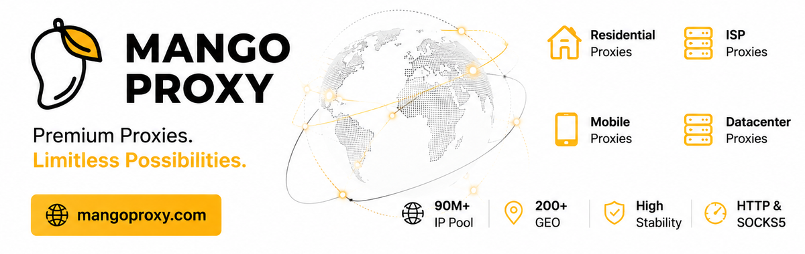

<p align="center"><a href="./README.md">English</a> | <strong>简体中文</strong></p>

<p align="center">
  <a href="https://webclaw.io">
    
  </a>
</p>

<h1 align="center">webclaw</h1>

<p align="center">
  <strong>将任意网页转化为干净的 Markdown、JSON 与 LLM 就绪的上下文。</strong><br/>
  <sub>面向 AI 智能体与 RAG 流水线的 CLI、MCP 服务器、REST API 与多语言 SDK。</sub>
</p>

<p align="center">
  <a href="https://github.com/0xMassi/webclaw/stargazers"></a>
  <a href="https://github.com/0xMassi/webclaw/releases"></a>
  <a href="https://github.com/0xMassi/webclaw/blob/main/LICENSE"></a>
  <a href="https://www.npmjs.com/package/create-webclaw"></a>
</p>

<p align="center">
  <a href="https://discord.gg/KDfd48EpnW"></a>
  <a href="https://x.com/webclaw_io"></a>
  <a href="https://webclaw.io"></a>
  <a href="https://webclaw.io/docs"></a>
</p>

<p align="center">
  
</p>

---

大多数网页抓取工具，只会给你的智能体两种糟糕的结果之一：

- 被拦截的页面、登录墙，或空壳应用（app shell）
- 塞满导航栏、脚本、样式、广告和重复模板的原始 HTML

[webclaw.io](https://webclaw.io) 是 webclaw 的托管式网页提取 API。本仓库包含开源的 CLI、MCP 服务器、提取引擎，以及可自托管的服务端。

webclaw 用 Rust 编写，把一个 URL 变成你的工具真正用得上的干净内容——它是一个**开源、可自托管的 Firecrawl 替代方案**。

```bash
webclaw https://example.com --format markdown
```

```md
# Example Domain

This domain is for use in illustrative examples in documents.

You may use this domain in literature without prior coordination or asking for permission.
```

在终端里直接用，通过 MCP 接入 Claude / Cursor，从你的应用调用托管 API，或者自托管这套开源服务端——任你选择。

---

## 安装

### 智能体一键配置

把 webclaw 接入 Claude Code、Claude Desktop、Cursor、Windsurf、OpenCode、Codex CLI 以及其他兼容 MCP 的工具，最快的方式是：

```bash
npx create-webclaw
```

安装器会自动检测已支持的客户端，并为你写好 MCP 服务器的配置。

### Homebrew

```bash
brew tap 0xMassi/webclaw
brew install webclaw
```

### 预编译二进制

从 [GitHub Releases](https://github.com/0xMassi/webclaw/releases) 下载 macOS、Linux 和 Windows 二进制文件。

### Docker

```bash
docker run --rm ghcr.io/0xmassi/webclaw https://example.com
```

### Cargo

```bash
cargo install --git https://github.com/0xMassi/webclaw.git webclaw-cli
cargo install --git https://github.com/0xMassi/webclaw.git webclaw-mcp
```

如果从源码构建时因缺少本机构建工具而失败，请先安装对应平台的依赖：

| 操作系统 | 命令 |
| --- | --- |
| Debian / Ubuntu | `sudo apt install -y pkg-config libssl-dev cmake clang git build-essential` |
| Fedora / RHEL | `sudo dnf install -y pkg-config openssl-devel cmake clang git make gcc` |
| Arch | `sudo pacman -S pkg-config openssl cmake clang git base-devel` |
| macOS | `xcode-select --install` |

---

## 快速开始

### 抓取单个页面

```bash
webclaw https://stripe.com --format markdown
```

### 返回 LLM 优化文本

```bash
webclaw https://docs.anthropic.com --format llm
```

### 只保留正文内容

```bash
webclaw https://example.com/blog/post --only-main-content
```

### 包含或排除选择器

```bash
webclaw https://example.com \
  --include "article, main, .content" \
  --exclude "nav, footer, .sidebar, .ad"
```

### 爬取一个文档站点

```bash
webclaw https://docs.rust-lang.org --crawl --depth 2 --max-pages 50
```

### 工作流示例

- [HTML 转 Markdown 用于 RAG](examples/html-to-markdown-rag/)
- [兼容 Firecrawl 的 API](examples/firecrawl-compatible-api/)
- [基于 MCP 的网页抓取](examples/mcp-web-scraping/)
- [使用 ColdProxy 的代理支持爬取](examples/proxy-backed-crawling/)

### 提取品牌资产

```bash
webclaw https://github.com --brand
```

### 对比页面随时间的变化

```bash
webclaw https://example.com/pricing --format json > pricing-old.json
webclaw https://example.com/pricing --diff-with pricing-old.json
```

---

## MCP 服务器

webclaw 内置了面向 AI 智能体的 MCP 服务器。

无需安装——把任意 MCP 客户端指向 npx 启动器即可：

```json
{
  "mcpServers": {
    "webclaw": {
      "command": "npx",
      "args": ["-y", "@webclaw/mcp"]
    }
  }
}
```

或者运行 `npx create-webclaw`，让它自动检测你的 AI 工具并替你写好配置。

配好之后，就可以让你的智能体做这样的事：

```text
抓取这些竞品的定价页面，并总结它们之间的差异。
```

```text
爬取这个文档站点，为 RAG 索引准备干净的上下文。
```

```text
从这家公司的官网提取品牌色、字体和 logo。
```

---

## 作为智能体 Skill 使用

一条命令，就能把 webclaw 添加到 Claude Code、Cursor、Windsurf 及其他 MCP 智能体：

```bash
npx skills add 0xMassi/webclaw-skill
```

你的智能体会把 scrape、crawl、map、extract、summarize、diff、brand、search 作为原生工具使用。多数站点无需 API Key 即可在本地提取；设置 `WEBCLAW_API_KEY` 后即可处理受保护以及需要 JavaScript 渲染的页面。

可在 [skills.sh](https://www.skills.sh/0xMassi/webclaw-skill/webclaw) 上找到它。

---

## 工具

| 工具 | 作用 | 本地 |
| --- | --- | :-: |
| `scrape` | 将单个 URL 提取为 markdown、text、JSON、LLM 格式或 HTML | 是 |
| `crawl` | 跟随同源链接并提取发现的页面 | 是 |
| `map` | 发现 URL，但不逐页提取 | 是 |
| `batch` | 并行抓取多个 URL | 是 |
| `extract` | 将页面内容转换为结构化数据 | 是（本地或已配置的 LLM） |
| `summarize` | 总结一个页面 | 是（本地或已配置的 LLM） |
| `diff` | 对比页面内容快照 | 是 |
| `brand` | 提取颜色、字体、logo 与元数据 | 是 |
| `search` | 搜索网络并抓取结果 | 托管 API |
| `research` | 多来源深度研究工作流 | 托管 API |

---

## SDK

```bash
npm install @webclaw/sdk
pip install webclaw
go get github.com/0xMassi/webclaw-go
```

<details>
<summary>TypeScript</summary>

```ts
import { Webclaw } from "@webclaw/sdk";

const client = new Webclaw({ apiKey: process.env.WEBCLAW_API_KEY! });

const page = await client.scrape({
  url: "https://example.com",
  formats: ["markdown"],
  only_main_content: true,
});

console.log(page.markdown);
```

</details>

<details>
<summary>Python</summary>

```python
from webclaw import Webclaw

client = Webclaw(api_key="wc_your_key")

page = client.scrape(
    "https://example.com",
    formats=["markdown"],
    only_main_content=True,
)

print(page.markdown)
```

</details>

<details>
<summary>cURL</summary>

```bash
curl -X POST https://api.webclaw.io/v1/scrape \
  -H "Authorization: Bearer $WEBCLAW_API_KEY" \
  -H "Content-Type: application/json" \
  -d '{
    "url": "https://example.com",
    "formats": ["markdown"],
    "only_main_content": true
  }'
```

</details>

---

## 输出格式

| 格式 | 适用场景 |
| --- | --- |
| `markdown` | 保留结构的干净页面内容 |
| `llm` | 面向智能体与 RAG 流水线的紧凑 LLM 上下文 |
| `text` | 最少格式的纯文本 |
| `json` | 结构化元数据、链接、图片与已提取字段 |
| `html` | 清洗后的 HTML，便于自定义处理 |

---

## 本地优先，按需上云

核心提取路径下，CLI 与 MCP 服务器无需账号即可在本地运行。

当你需要以下能力时，使用托管 API [webclaw.io](https://webclaw.io)：

- 无需自行运维基础设施即可访问受保护的站点
- JavaScript 渲染
- 异步的爬取与研究任务
- 网络搜索
- 页面监控（watches）与生产用量统计
- 供应用代码调用的 SDK

```bash
export WEBCLAW_API_KEY=wc_your_key

webclaw https://example.com --cloud
```

---

## 你可以用它构建什么

| 场景 | 示例 |
| --- | --- |
| AI 智能体的网页访问 | 为 Claude、Cursor 或其他 MCP 客户端提供干净的页面上下文 |
| RAG 数据入库 | 爬取文档、帮助中心、博客与知识库 |
| 竞品监控 | 追踪定价页、更新日志、文档与产品页 |
| 结构化提取 | 把杂乱的页面变成带类型的 JSON，用于自动化 |
| 研究工作流 | 搜索、抓取、总结并引用多个来源 |
| 品牌情报 | 提取 logo、颜色、字体与社交元数据 |

## 架构

```text
webclaw/
  crates/
    webclaw-core     HTML 转 markdown、text、JSON 与 LLM 就绪输出
    webclaw-fetch    抓取、爬取、批处理与站点映射
    webclaw-llm      本地与托管 LLM 提供方支持
    webclaw-pdf      PDF 文本提取
    webclaw-mcp      面向 AI 智能体的 MCP 服务器
    webclaw-cli      命令行界面
```

`webclaw-core` 是纯粹的提取逻辑：没有网络 I/O，接口面小，可脱离抓取层独立使用。

---

## 配置

| 变量 | 说明 |
| --- | --- |
| `WEBCLAW_API_KEY` | 托管 API 密钥 |
| `OLLAMA_HOST` | 本地 LLM 功能所用的 Ollama 地址 |
| `OPENAI_API_KEY` | 兼容 OpenAI 的 LLM 提供方密钥 |
| `OPENAI_BASE_URL` | 兼容 OpenAI 的接口地址 |
| `ANTHROPIC_API_KEY` | 兼容 Anthropic 的 LLM 提供方密钥 |
| `ANTHROPIC_BASE_URL` | 兼容 Anthropic 的接口地址 |
| `WEBCLAW_PROXY` | 单个代理 URL |
| `WEBCLAW_PROXY_FILE` | 代理池文件 |

---

## 参与贡献

眼下最有价值的贡献都很务实、也很小：

- 为真实的智能体与 RAG 工作流补充示例
- 改进 SDK 代码片段
- 上报提取效果不佳的页面
- 为杂乱的 HTML 添加会失败的测试样例（fixtures）
- 完善面向 MCP 客户端与本地配置的文档
- 在更多 Linux / macOS 环境上测试 CLI

不错的入手点：

- [Good first issues](https://github.com/0xMassi/webclaw/issues?q=label%3A%22good+first+issue%22)
- [提交一个 bug 报告](https://github.com/0xMassi/webclaw/issues/new)
- [发起一场讨论](https://github.com/0xMassi/webclaw/discussions)

如果某个页面提取效果不好，请附上：

```text
URL:
命令或 API 请求:
期望输出:
实际输出:
使用的格式: markdown / llm / text / json / html
使用方式: CLI / MCP / SDK / API:
```

发帖前，请从日志中移除密钥、Cookie、私有令牌和客户数据。

---

## 基础设施合作伙伴

<table>
  <tr>
    <td align="center">
      <a href="https://coldproxy.com/?utm_source=github&utm_medium=sponsorship&utm_campaign=webclaw-sponsor">
        
      </a>
    </td>
  </tr>
  <tr>
    <td>
      <strong>ColdProxy</strong> 作为基础设施合作伙伴支持 webclaw，提供覆盖 195+ 个国家/地区的住宅 IPv4、
      住宅 IPv6 与数据中心 IPv6 代理基础设施，适用于公开数据采集、区域测试、监控与网页抓取工作流。
      在官网了解 <a href="https://coldproxy.com/?utm_source=github&utm_medium=sponsorship&utm_campaign=webclaw-sponsor">ColdProxy</a> 的最新套餐与优惠。
      使用优惠码 <code>webclaw8Off</code>，首单可享 8% 折扣。
      详见<a href="examples/proxy-backed-crawling/#using-coldproxy">代理支持爬取指南</a>，了解如何把 ColdProxy 接入 webclaw。
    </td>
  </tr>
</table>

---

## 工作室合作伙伴

<table>
  <tr>
    <td width="340" align="center">
      <a href="https://go.nodemaven.com/webclawgh">
        
      </a>
    </td>
    <td>
      <strong>NodeMaven</strong> 提供市场上最可靠、IP 质量最高的代理服务。适用于自动化、网页抓取、SEO 研究
      与社媒管理：99.9% 在线率、最长 7 天的粘性会话、IP 过滤（所有代理欺诈评分低于 97%）、无需 KYC，
      并提供最高 10% 的流量返现。在 <a href="https://go.nodemaven.com/webclawgh">NodeMaven</a> 使用
      <code>WEBCLAW35</code> 享移动与住宅代理 35% 折扣，或用 <code>WEBCLAW40</code> 享 ISP（静态）代理 40% 折扣。
    </td>
  </tr>
  <tr>
    <td width="340" align="center">
      <a href="https://mangoproxy.com/?utm_source=github&utm_medium=partner&utm_campaign=0xmassi">
        
      </a>
    </td>
    <td>
      <strong>MangoProxy</strong> 提供覆盖 200+ 地区的住宅、ISP、数据中心与移动代理，背靠 9000 万+ IP 池，
      支持 HTTP 与 SOCKS5，为大规模网页抓取与数据采集提供高稳定性。在
      <a href="https://mangoproxy.com/?utm_source=github&utm_medium=partner&utm_campaign=0xmassi">mangoproxy.com</a>
      使用优惠码 <code>0XMASSI</code> 享 ISP（静态）代理 8% 折扣。
    </td>
  </tr>
</table>

---

## 社区插件

将 webclaw 集成到 AI 智能体平台的第三方插件：

| 插件 | 平台 | 作用 |
|---|---|---|
| [openclaw-webclaw](https://github.com/jal-co/openclaw-webclaw) | [OpenClaw](https://openclaw.ai) | 原生 webclaw v1 API 插件，含 9 个工具：scrape、search、crawl、extract、summarize、diff、map、batch、brand |
| [hermes-webclaw](https://github.com/jal-co/hermes-webclaw) | [Hermes Agent](https://github.com/NousResearch/hermes-agent) | 面向完整 v1 API 的网络搜索提供方与 9 个专用工具。通过 `hermes plugins install jal-co/hermes-webclaw` 安装 |

做了 webclaw 集成？欢迎 [提交 PR](https://github.com/0xMassi/webclaw/pulls) 把它加到这里。

---

## 贡献者

感谢每一位通过 issue、示例、文档、bug 报告与 PR 改进 webclaw 的人。

<a href="https://github.com/0xMassi/webclaw/graphs/contributors">
  
</a>

---

## Star 历史

<a href="https://github.com/0xMassi/webclaw/stargazers">
 <picture>
   <source media="(prefers-color-scheme: dark)" srcset="https://shieldcn.dev/chart/github/stars/0xMassi/webclaw.svg?mode=dark&theme=zinc&bg=transparent&border=false&logo=false&icon=Star" />
   <source media="(prefers-color-scheme: light)" srcset="https://shieldcn.dev/chart/github/stars/0xMassi/webclaw.svg?mode=light&theme=zinc&bg=transparent&border=false&logo=false&icon=Star" />
   
 </picture>
</a>

---

## 许可证

[AGPL-3.0](LICENSE)
